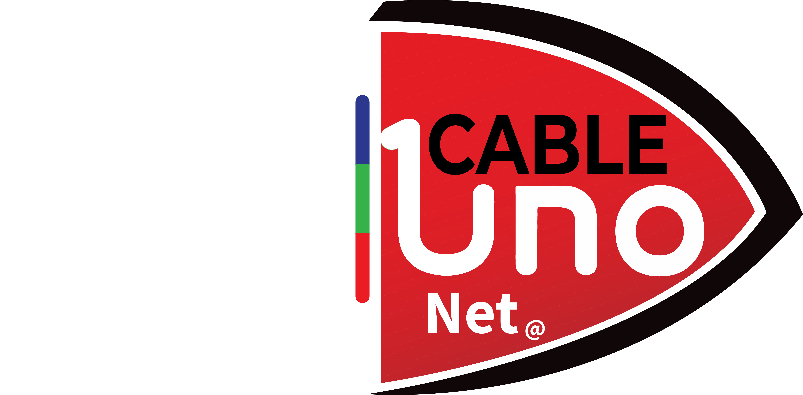

# 📱 Cable Uno Play - App IPTV para Android

<div align="center">
  
  
  **Aplicación IPTV multiplataforma estilo IPTV Smarters Pro**
  
  [](https://web.dev/progressive-web-apps/)
  [](https://www.android.com/)
  [](https://capacitorjs.com/)
</div>

---

## 📖 Tabla de Contenidos

- [¿Qué es Cable Uno Play?](#qué-es-cable-uno-play)
- [Características](#características)
- [Instalación Rápida (PWA)](#instalación-rápida-pwa)
- [Descargar Proyecto](#descargar-proyecto)
- [Compilar APK](#compilar-apk-en-android-studio)
- [Estructura del Proyecto](#estructura-del-proyecto)
- [Desarrollo Local](#desarrollo-local)

---

## 🎯 ¿Qué es Cable Uno Play?

**Cable Uno Play** es una aplicación IPTV moderna que permite ver televisión en vivo, películas, series y contenido bajo demanda desde cualquier dispositivo. Inspirada en **IPTV Smarters Pro**, ofrece:

- 📺 **TV en Vivo** - Streaming de canales IPTV
- 🎬 **VOD** - Películas bajo demanda
- 📺 **Series** - Temporadas y episodios organizados
- ⭐ **Favoritos** - Guarda tus canales preferidos
- 📅 **EPG** - Guía de programación electrónica
- ⏮️ **Catch-Up TV** - Ver programas pasados
- 🔒 **Control Parental** - Bloqueo con PIN

### Modo Freemium

- **🆓 GRATIS**: Reproducir listas M3U básicas
- **💎 PREMIUM**: Todas las funciones (activado con credenciales)

---

## ✨ Características

### Versión Gratuita
- ✅ Reproducción de listas M3U/M3U8
- ✅ Soporte HTTP y HTTPS
- ✅ Proxy automático para Mixed Content
- ✅ Autenticación HTTP básica
- ✅ Reproductor HLS.js optimizado

### Versión Premium (con credenciales)
- 🌟 **Xtream Codes API** - Login con usuario/contraseña/servidor
- 🌟 **Múltiples Playlists** - Gestiona varios proveedores
- 🌟 **Favoritos** - Marca tus canales preferidos
- 🌟 **Historial** - Ve qué has reproducido
- 🌟 **EPG** - Guía de programación completa
- 🌟 **VOD** - Catálogo de películas
- 🌟 **Series** - Temporadas y episodios
- 🌟 **Catch-Up TV** - Ve programas anteriores
- 🌟 **Control Parental** - Protección con PIN
- 🌟 **Búsqueda Avanzada** - Encuentra contenido rápido

---

## 🚀 Instalación Rápida (PWA)

### Opción Recomendada: Instalar como PWA

**Sin descargas, sin APK, funciona instantáneamente**

1. Abre Chrome en tu Android
2. Visita: `https://[tu-dominio].replit.dev`
3. Menú → "Agregar a pantalla de inicio"
4. ¡Listo! Abre la app desde tu pantalla de inicio

#### Ventajas PWA:
- 📦 **Ligera** - No ocupa mucho espacio
- 🔄 **Auto-actualiza** - Siempre la última versión
- ⚡ **Rápida** - Carga instantánea después de instalada
- 📴 **Offline** - Funciona sin internet (excepto streams)
- 🎨 **Nativa** - Se ve y funciona como app instalada

---

## 📥 Descargar Proyecto

### Método 1: Desde Replit (Recomendado)

1. **En Replit:**
   - Click en los tres puntos `...` (esquina superior derecha)
   - Selecciona **"Download as ZIP"**

2. **Descomprime el archivo:**
   ```bash
   unzip cable-uno-play.zip
   cd cable-uno-play
   ```

### Método 2: Git Clone (Si está conectado a GitHub)

```bash
git clone https://github.com/[TU-USUARIO]/cable-uno-play.git
cd cable-uno-play
```

### Método 3: Exportar a GitHub desde Replit

1. En Replit: **Tools** → **Git**
2. Conecta tu cuenta de GitHub
3. **Create repo** → Dale un nombre
4. Ahora puedes clonar desde GitHub

---

## 🔨 Compilar APK en Android Studio

### Prerequisitos

Antes de empezar, asegúrate de tener instalado:

- ✅ **Node.js** 18+ ([Descargar](https://nodejs.org/))
- ✅ **Android Studio** ([Descargar](https://developer.android.com/studio))
- ✅ **Java JDK 17** ([Descargar](https://adoptium.net/))

### Paso 1: Instalar Dependencias

```bash
cd cable-uno-play
npm install
```

### Paso 2: Build de Producción

```bash
npm run build
```

Esto genera los archivos optimizados en `dist/public/`

### Paso 3: Sincronizar con Capacitor

```bash
npx cap sync android
```

Esto copia los archivos web al proyecto Android.

### Paso 4: Abrir en Android Studio

```bash
npx cap open android
```

O abre manualmente:
- **Android Studio** → **Open** → Selecciona carpeta `android/`

### Paso 5: Compilar APK

**Opción A: Desde Android Studio**

1. Menú **Build** → **Build Bundle(s) / APK(s)** → **Build APK(s)**
2. Espera a que compile (2-5 minutos)
3. Click en **"locate"** cuando termine

**Opción B: Desde Terminal**

```bash
cd android
chmod +x gradlew
./gradlew assembleDebug
```

### Paso 6: Encontrar tu APK

El APK estará en:
```
android/app/build/outputs/apk/debug/app-debug.apk
```

### Paso 7: Instalar en Android

1. Copia `app-debug.apk` a tu teléfono (USB, email, etc.)
2. Abre el archivo desde **Mis Archivos**
3. Si sale advertencia:
   - **Configuración** → **Seguridad** → **Orígenes desconocidos** → ✅ Permitir
4. Toca **Instalar**
5. ¡Disfruta! 🎉

---

## 📁 Estructura del Proyecto

```
cable-uno-play/
│
├── 📱 client/                    # Frontend (React + Vite)
│   ├── src/
│   │   ├── pages/
│   │   │   └── simple-player.tsx    # Reproductor principal
│   │   ├── components/
│   │   │   └── player/
│   │   │       └── video-player.tsx # Reproductor HLS
│   │   └── lib/
│   │       └── utils/
│   │           └── m3u-parser.ts    # Parser M3U mejorado
│   ├── public/
│   │   ├── manifest.json         # PWA Manifest
│   │   ├── service-worker.js     # Service Worker
│   │   └── images/               # Íconos y logos
│   └── index.html
│
├── ⚙️ server/                    # Backend (Express)
│   ├── index.ts                  # Servidor principal
│   └── routes.ts                 # API (proxy de streams)
│
├── 📱 android/                   # Proyecto Android (Capacitor)
│   ├── app/
│   │   └── build/outputs/apk/   # ✨ APKs compilados aquí
│   ├── gradle/
│   └── build.gradle
│
├── 🗄️ shared/                    # Código compartido
│   └── schema.ts                 # Schemas base de datos
│
├── 📝 Configuración
│   ├── capacitor.config.ts       # Config Capacitor
│   ├── vite.config.ts            # Config Vite
│   ├── package.json
│   └── tsconfig.json
│
└── 📚 Documentación
    ├── README_ANDROID.md         # Este archivo
    ├── INSTALACION_APK.md        # Guía detallada
    └── replit.md                 # Documentación técnica
```

---

## 💻 Desarrollo Local

### Iniciar Servidor de Desarrollo

```bash
npm install
npm run dev
```

La app estará disponible en: `http://localhost:5000`

### Comandos Útiles

```bash
# Desarrollo
npm run dev              # Servidor dev (frontend + backend)
npm run build           # Build de producción
npm run check           # TypeScript check

# Base de Datos (requiere PostgreSQL configurado)
npm run db:push         # Sincronizar schema
npm run db:seed         # Poblar con datos de prueba

# Capacitor
npx cap sync            # Sincronizar cambios
npx cap open android    # Abrir Android Studio
npx cap open ios        # Abrir Xcode (Mac only)
```

### Tecnologías Usadas

- **Frontend**: React 18, TypeScript, Tailwind CSS, shadcn/ui
- **Routing**: Wouter
- **Video**: HLS.js
- **State**: TanStack Query
- **Backend**: Express.js, Node.js
- **Database**: PostgreSQL (Drizzle ORM)
- **Mobile**: Capacitor 7
- **PWA**: Service Workers, Web App Manifest

---

## 🎨 Personalización

### Cambiar Colores Corporativos

Edita `client/src/index.css`:

```css
:root {
  --primary: #DC2626;      /* Rojo Cable Uno */
  --background: #000000;   /* Negro */
  /* Cambia estos valores a tus colores */
}
```

### Cambiar Logo

1. Reemplaza: `client/public/images/cable-uno-logo.png`
2. Genera íconos PWA: https://realfavicongenerator.net/
3. Coloca en:
   - `client/public/images/icon-192.png`
   - `client/public/images/icon-512.png`

### Cambiar Nombre de la App

1. **`capacitor.config.ts`**: Cambia `appName`
2. **`client/public/manifest.json`**: Cambia `name` y `short_name`
3. **`client/index.html`**: Cambia `<title>`
4. **`android/app/src/main/res/values/strings.xml`**: Cambia `app_name`

---

## 🐛 Solución de Problemas

### Error: "SDK location not found"

```bash
# En la raíz del proyecto Android
echo "sdk.dir=/Users/TU_USUARIO/Library/Android/sdk" > android/local.properties
# Ajusta la ruta según tu instalación de Android SDK
```

### Error: "JAVA_HOME not set"

```bash
# Linux/Mac
export JAVA_HOME=/usr/lib/jvm/java-17-openjdk
export PATH=$JAVA_HOME/bin:$PATH

# Windows (CMD)
set JAVA_HOME=C:\Program Files\Java\jdk-17
set PATH=%JAVA_HOME%\bin;%PATH%
```

### APK no se instala

- Asegúrate de que sea `app-debug.apk` (no `app-release.apk` sin firmar)
- Habilita "Instalar apps desconocidas" en Configuración
- Desinstala versiones anteriores primero

### Streams no cargan en la app

Antes de compilar, actualiza la URL de producción en `client/src/lib/queryClient.ts`:

```typescript
// Cambia de:
const baseURL = '';

// A tu servidor de producción:
const baseURL = 'https://tu-servidor.com';
```

---

## 📞 Soporte

¿Tienes problemas?

1. **Lee** `INSTALACION_APK.md` - Guía completa paso a paso
2. **Verifica logs** en Android Studio (Logcat)
3. **Revisa** que todas las dependencias estén instaladas

---

## 🚀 Roadmap

- [x] Reproductor M3U básico
- [x] Soporte HTTP/HTTPS con proxy
- [x] Autenticación HTTP básica
- [x] PWA instalable
- [x] Build Android con Capacitor
- [ ] Xtream Codes API
- [ ] Sistema de favoritos
- [ ] EPG (Guía de programación)
- [ ] VOD (Películas)
- [ ] Series TV
- [ ] Catch-Up TV
- [ ] Control parental
- [ ] Multi-pantalla
- [ ] Chromecast
- [ ] Build iOS

---

## 📄 Licencia

Proyecto de código abierto para uso educativo y personal.

---

## 🎉 ¡Disfruta Cable Uno Play!

Si tienes dudas o sugerencias, revisa la documentación completa o abre un issue.

**¡Feliz streaming! 📺🍿**
